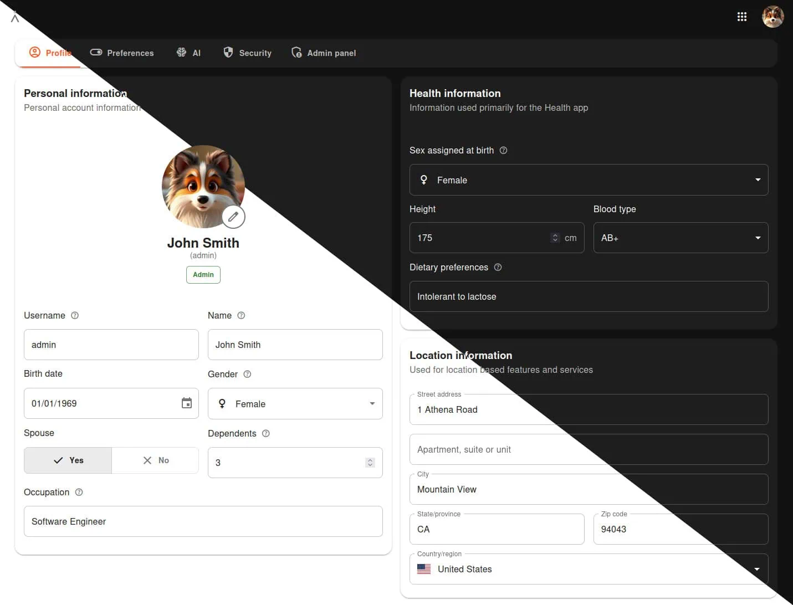
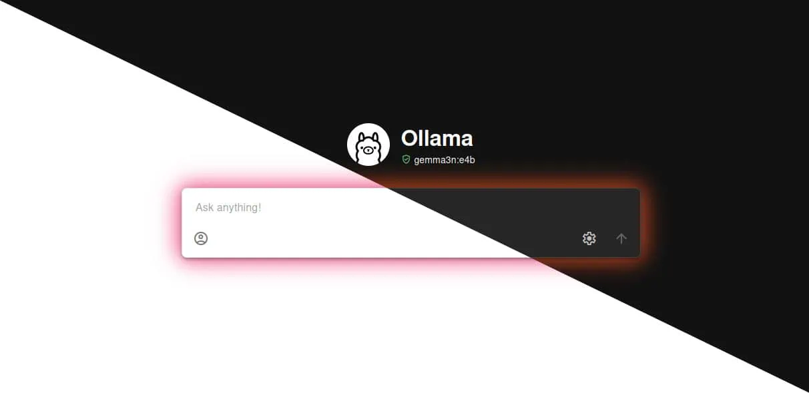
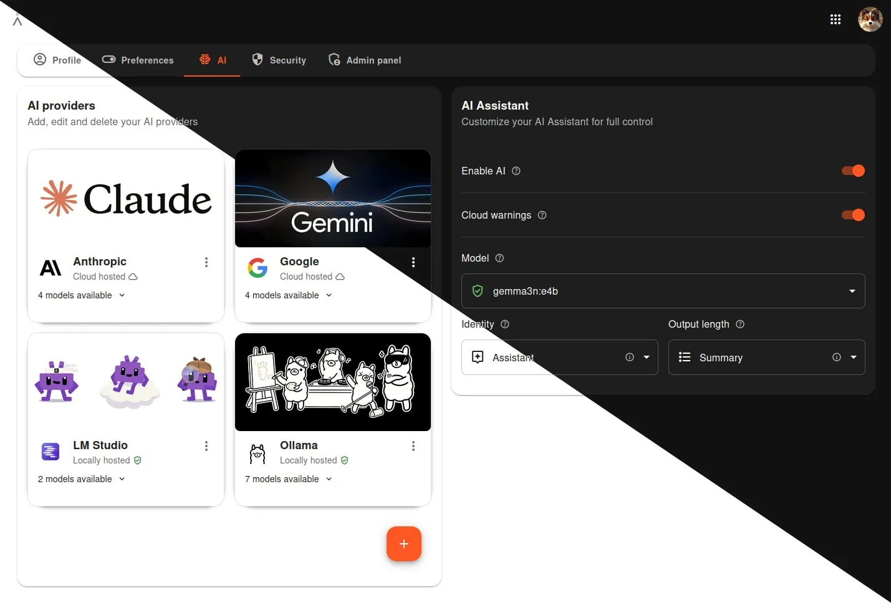
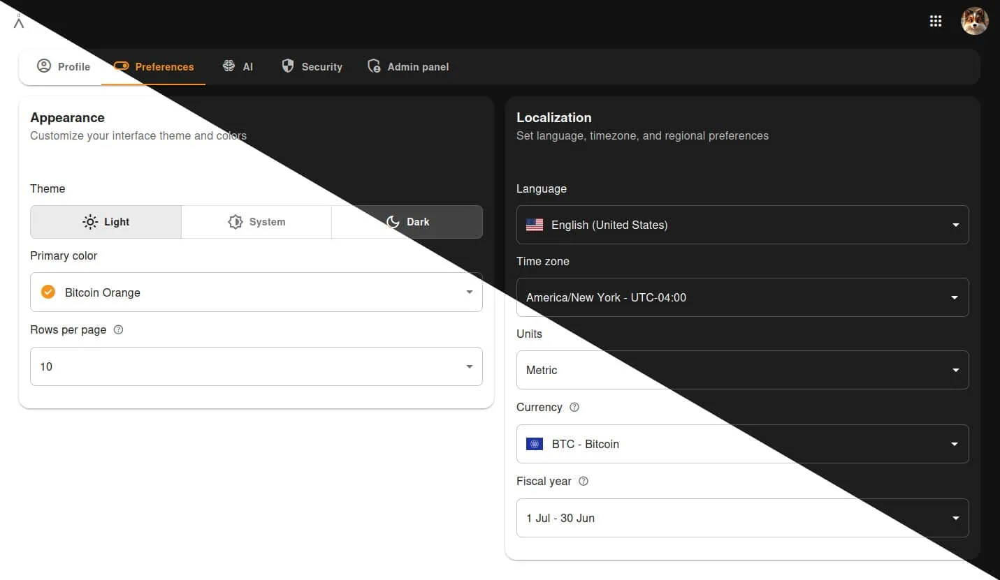
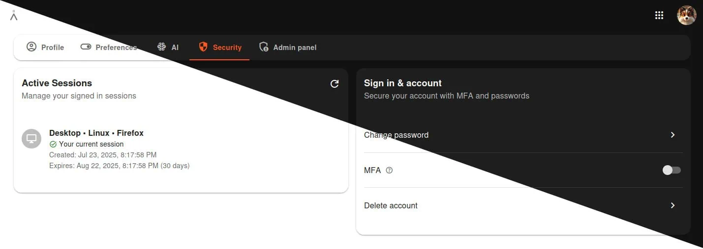

<h1>Athena</h1>

 

> Your personal life manager, built with privacy, choice and beauty at its heart.

&nbsp;  &nbsp;  
 &nbsp;  

Athena's purpose is to provide a local, highly secure and private space to store, manage, display and give insights into all the most vital information in your life. From Finance data (cash flows, assets and liabilities) to critical Health data (conditions, therapies, test results, medical history) and more, Athena allows you to store and view your data in a modern, beautiful and fast platform.

A platform that's completely divorced from big tech, their constant privacy-invading intrusions, their ads, their instability, their subscriptions and never ending bull shit. It is your data, stored in your database, run on your computer and all fully under your control. Forever.

## Principles
- **Privacy:** Your private data is yours and yours alone. Athena is proudly built from the ground up for fast and simple local hosting to ensure you wield absolute sovereign control over your data, now and forever. No cloud. No third parties. No unknown algorithms. No subscriptions and no ads
- **Choice:** Athena is Free and Open Source Software (FOSS), built to industry standard best practices, it allows you to configure, expand or integrate it in whatever way you want. With open, local API's and no arbitrary barriers to interoperability, you decide how your data is accessed, what features to enable, what the interface looks like and what language, color, currency or defaults it uses
- **Beauty:** Free, open source, local and privacy focused software should be just as beautiful, modern and seamless as the latest big tech app. Athena is built using the latest software stacks with an eye for detail and user experience, because your data should be beautiful, powerful and fast

## Features
> Beautiful, modern and fast Material UI design, because your data shouldn't be ugly

 

> State of the art AI chat interface with buttons for quickly adding personal data

 

> Support for local and cloud based AI providers, plus a variety of identity and output options

 

> Customizable theme colors, light and dark modes, multiple languages and more

 

> Built from the ground up to be fully self hosted to ensure complete security, privacy and control

 

**But wait, there's more!**
- Full Admin Panel area to manage users, application software & settings, audit and system logs
- Fully responsive design built for mobile, tablet and desktop
- Hyper focussed on security and privacy with dozens and dozens of industry standard [security features](docs/security.md)
- **Athena Strategy:** Plan, organize and track your life goals, milestones and progress **[Coming soon...]**
- **Athena Health:** Track and manage your Health Providers, Test Results, Therapies and Conditions **[Coming soon...]**
- **Athena Finance:** Track and manage your Cash Flow, Assets and Liabilities  **[Coming soon...]**

## Tech Stack
We strive to use the most up to date LTS software stacks for their enhanced security, stability and functionality. We use third party dependencies only as a last resort to decrease supply chain risks and build all code to industry standard best practices with full documentation.

- **[Athena Client:](https://github.com/athena-alpha/athena-client)** is built using [Node.js v24](https://nodejs.org) + [React v19](https://react.dev) + [Vite v6](https://vite.dev) + [React Router v7](https://reactrouter.com) + [TypeScript v5](https://www.typescriptlang.org) + [MUI v7](https://mui.com), the Client is what the user sees and interacts with
- **[Athena Server:](https://github.com/athena-alpha/athena-server)** is built using [PHP-FPM v8](https://www.php.net) + [Slim 4](https://www.slimframework.com) + [Composer](https://getcomposer.org/) and conforms to [PSR](https://www.php-fig.org/psr/) + [RFC](https://www.rfc-editor.org/rfc) + [MVC](https://en.wikipedia.org/wiki/Model%E2%80%93view%E2%80%93controller) standards, the Server provides an open RESTful API to the Client using standard JSON responses
- **Database:** Built using MariaDB, the Database stores all application and users data and can be [directly accessed](/docs/installation.md#direct-database-access)
- **Nginx:** Proxies external HTTPS traffic to the Client (port 3000) and Server (port 9000)
