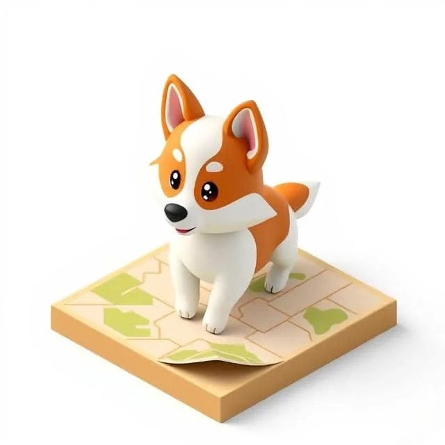
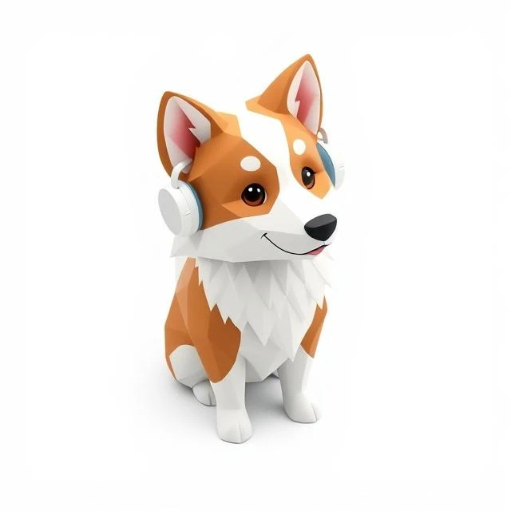
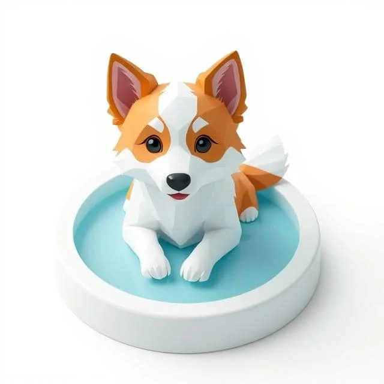
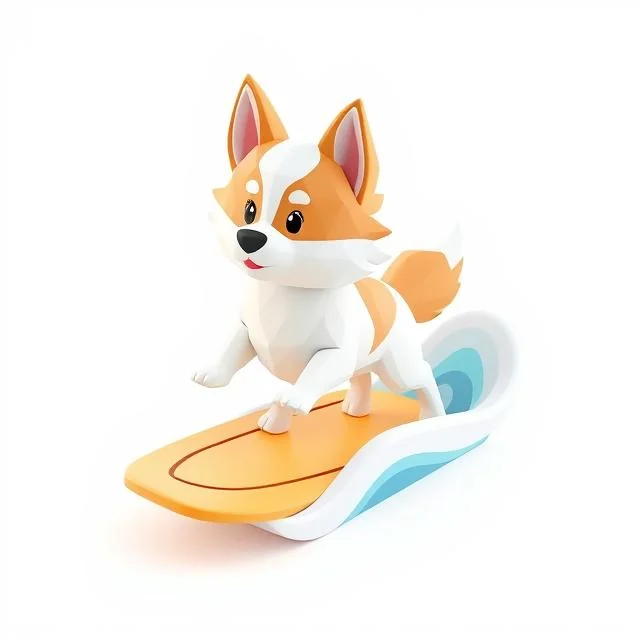

# Thaddeus - The Athena Mascot!

## Overview
The official mascot of Athena is Thaddeus, a super cute Shetland Sheepdog. This loyal, intelligent, and playful pup symbolizes Athena’s mission to provide a secure, user-controlled, and elegant platform for managing your personal data. Thaddeus reflects trust, protection, loyalty and fun.

## Image Generation
Thaddeus is a dynamic mascot, changing and evolving with the images that are generated via [Deep AI’s Origami 3D Generator](https://deepai.org/machine-learning-model/origami-3d-generator) using the prompt:
> A super cute, Disney-like white and brown Shetland Sheepdog puppy doing [action]...

## Usage Guidelines
- **Open Use**: Anyone can generate and use Thaddeus images via the Deep AI prompt for Athena-related purposes (e.g., UI, marketing, documentation).
- **Appropriateness**: Keep depictions respectful and aligned with Athena’s values (privacy, choice, beauty). Avoid inappropriate or off-brand actions.
- **Consistency**: Use Disney-like, white-and-brown Shetland Sheepdog visuals in a modern, clean style, suitable for light/dark themes.
- **Assets**: Thaddeus image files are located in the [mascot](images/mascot) folder
